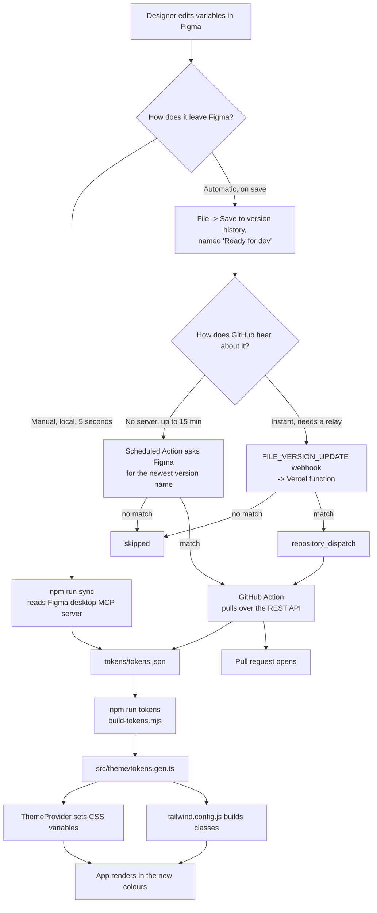
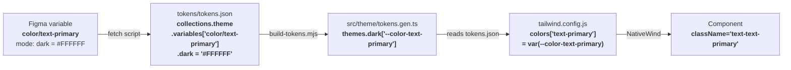
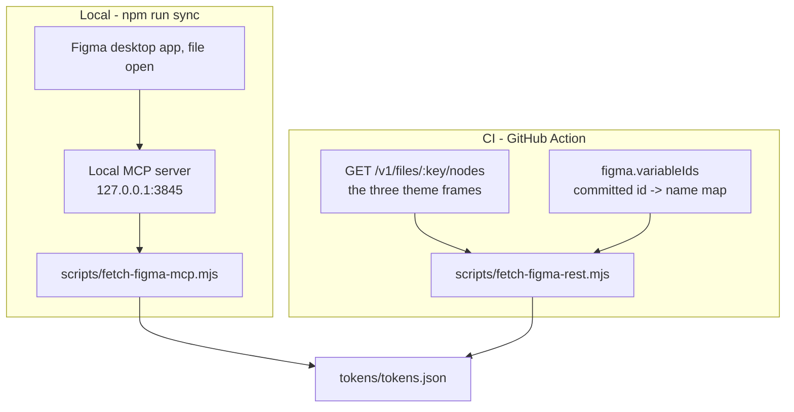

# expo-figma-tokens

**The problem this repo solves:** a designer changes a colour in Figma, and that change reaches the
Expo app without anyone copying a hex code by hand.

Three themes - Light, Dark, Ocean - are Figma variable *modes*. Add a fourth mode in Figma and it
appears in the app with no code change.

Figma file: <https://www.figma.com/design/QFShnF5EA3cNl8afImTyuj/Untitled>

---

## 1. The whole flow



Both routes end at the same file. The app never learns which one produced it.

---

## 2. Where each variable lands, step by step

This is the part that has to be exact, or a rename in Figma silently breaks a screen.



### The four rules

**Rule 1 - the mode map decides which theme a value belongs to.**
`tokens/tokens.json` carries a `figma` block naming the Figma node that represents each mode:

```json
"figma": {
  "fileKey": "QFShnF5EA3cNl8afImTyuj",
  "themeNodes": { "light": "2:67", "dark": "2:68", "ocean": "2:69" }
}
```

The sync script asks Figma for the variable values *as resolved on that node*, once per mode. The
key in `themeNodes` becomes the theme name in the app. To add a theme: add its frame in Figma, add
one line here, re-sync.

**Rule 2 - the variable name becomes the CSS variable.** Slashes become dashes:

| Figma variable | CSS variable | Tailwind key |
|---|---|---|
| `color/text-primary` | `--color-text-primary` | `text-primary` |
| `color/card-bg` | `--color-card-bg` | `card-bg` |
| `color/border-subtle` | `--color-border-subtle` | `border-subtle` |

**Rule 3 - the `color/` prefix is dropped for the class name, so the prefix comes from the CSS
property**, not the token. `color/card-bg` is `bg-card-bg` on a background and `text-card-bg` on
text. `color/text-primary` used as text colour is therefore `text-text-primary` - repetitive, but it
keeps the Figma name intact rather than inventing a second vocabulary.

**Rule 4 - a token missing from one mode is a hard error.** Both fetch scripts compare every
variable across every mode and exit non-zero with the list of gaps. Without this, a variable added
only to Light renders as `undefined` in Dark, which looks like a styling bug rather than a Figma
one.

### What is not synced yet

Only **colour** variables. Spacing, radius and type sizes were read off the design and live in
`collections.primitives` as a plain numeric scale (`p-16`, `rounded-16`, `text-13`) so no component
needs an arbitrary value. When the designer promotes those to Figma variables, extend
`scripts/fetch-figma-mcp.mjs` to pull that collection too.

---

## 3. The two sync routes, and when to use which



| | Local MCP | CI REST |
|---|---|---|
| Needs a token | no | yes, `FIGMA_TOKEN` |
| Needs Figma desktop running | yes | no |
| Works in GitHub Actions | **no** | yes |
| Figma plan | any | any |
| Speed | ~5 seconds | ~1 minute |

### Why CI does not just call the Variables API

`GET /v1/files/:key/variables/local` returns exactly the table we want, but it needs the
`file_variables:read` scope, and Figma gates that scope to the Enterprise plan. There is no way to
grant it on a lower plan.

The plain file endpoint needs only `file_content:read`, which every plan has. It does not hand back
variables - but every node it returns carries `boundVariables` (which variable a fill or stroke
uses) **and** the colour that variable resolved to on that frame. Read the light frame and you get
the light values; read the dark frame and you get the dark ones. Same table, assembled from the
design instead of from the variables panel.

The one thing the file endpoint will not tell us is what a variable is **called** - it only gives
ids like `VariableID:12:34`. So `npm run tokens:map` runs once on a Mac, joins the ids from REST
with the names from the local MCP server (both are keyed by node id), and commits the result to
`tokens/tokens.json` under `figma.variableIds`. CI reads that map and never needs the MCP server.

Re-run `npm run tokens:map` when the designer **renames, adds, or removes** a variable. Changing a
colour value does not need it.

The MCP server only runs next to the Figma desktop app, so CI can never reach it. That is why both
routes exist.

---

## 4. Run it

```bash
npm install && npm run tokens && npx expo start
```

| Command | What it does |
|---|---|
| `npm run sync` | Pull from Figma desktop, then rebuild the theme |
| `npm run tokens` | Rebuild `src/theme/tokens.gen.ts` from `tokens/tokens.json` |
| `npm run tokens:mcp` | Pull from Figma desktop only |
| `npm run tokens:fetch` | Pull over the Figma REST API, resolving colours from the theme frames (what CI runs) |
| `npm run tokens:map` | One-time: rebuild the variable-id map (needs Figma desktop open on the file) |
| `npm run typecheck` | `tsc --noEmit` |

`tokens/tokens.json` is the hand-off file. Never edit it by hand - the next sync overwrites it.

---

## 5. Test it end to end in two minutes

1. `npx expo start --web` and open the app.
2. In Figma, open the file and change `color/primary` in the **Light** mode to something obvious.
3. `npm run sync`
4. The app reloads. Every blue thing is the new colour.

If step 3 says it cannot reach the server: Figma menu -> Preferences -> **Enable local MCP server**.

---

## 6. Styling

NativeWind (Tailwind for React Native) with CSS variables - the shadcn pattern. `ThemeProvider`
sets the variables on a wrapper view; components never name a theme:

```tsx
<View className="w-full rounded-16 bg-card-bg p-16">
  <Text className="text-16 text-text-primary">Themed without knowing which theme.</Text>
</View>
```

Full rules, token table, and what each colour is for: [DESIGN.md](DESIGN.md).
Automation setup, including which route fits your Figma plan: [docs/figma-sync.md](docs/figma-sync.md).
