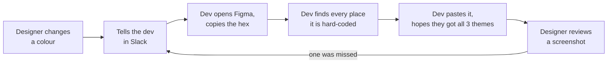
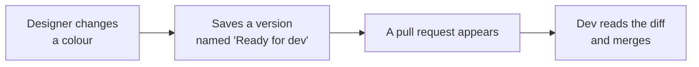
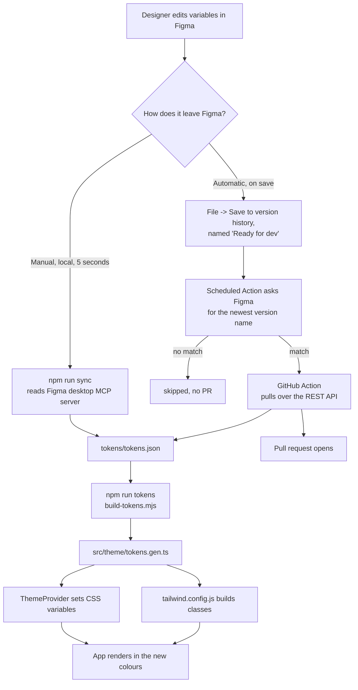
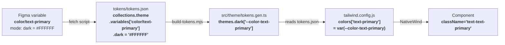
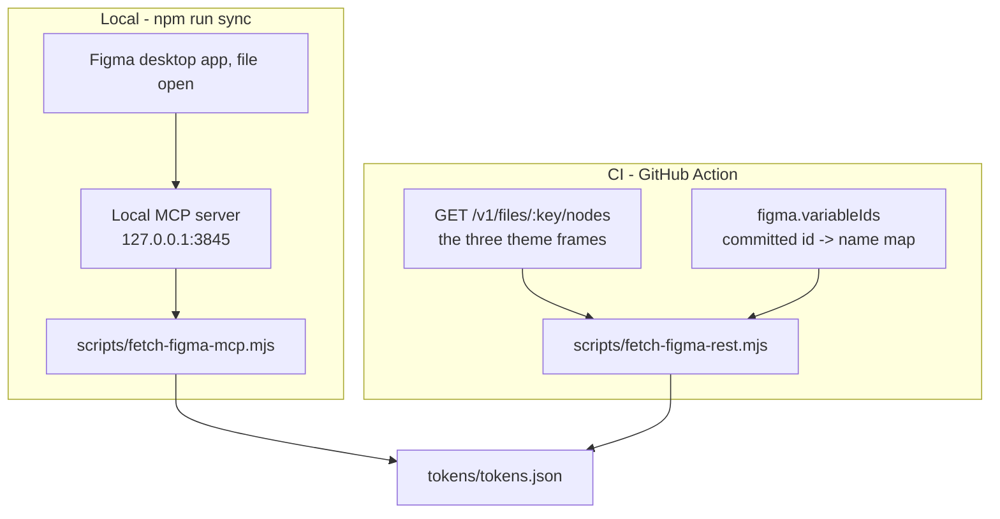

# expo-figma-tokens

A designer changes a colour in Figma. A pull request appears in this repo with that colour changed.
Nobody typed a hex code.

Three themes - Light, Dark, Ocean - are Figma variable *modes*. Add a fourth mode in Figma and it
shows up in the app with no code change.

Figma file: <https://www.figma.com/design/QFShnF5EA3cNl8afImTyuj/Untitled>

---

## 0. Why bother

### The thing this replaces

Without it, a colour change is a conversation:



Every arrow is a place it goes wrong. The usual failures:

| Failure | What it looks like |
|---|---|
| A theme is forgotten | Light gets the new colour, Ocean keeps the old one |
| A hex is mistyped | `#3D6BF5` becomes `#3D68F5`, nobody notices for a month |
| The change is never asked for | The designer stops bothering for small fixes, and design drifts |
| Nobody knows what is current | Figma says one thing, the app says another, neither is wrong on paper |

### What replaces it



Four steps, two of them automatic. What it buys:

- **One source of truth.** Figma holds the values. This repo holds a generated copy. A hex code
  exists in exactly one place a human edits, and that place is Figma.
- **A colour change is a reviewable diff.** `- "#3D6BF5"` / `+ "#E04747"` in a PR, with the theme
  it belongs to next to it. Not a screenshot, not a Slack thread.
- **All modes move together.** The build fails if a variable is missing from any theme, so a
  half-applied change cannot reach the app.
- **A rename breaks the build, loudly.** If the designer renames `color/primary`, the class
  `bg-primary` stops existing and `tsc` says so - instead of the app quietly rendering nothing.
- **The designer keeps working in Figma.** No export step, no plugin to remember, no handoff doc.
  Saving a named version is the whole interface.

### What it costs

- One extra habit for the designer: name the version `Ready for dev` when it is ready. Any other
  name is ignored, so unfinished work stays out.
- The variable name in Figma **is** the API. Renaming one is a breaking change, on purpose.
- A one-time `npm run tokens:map` on a Mac whenever a variable is added, renamed or removed. See
  section 3.

### When it is not worth it

If one person is both designer and developer, and the palette has six colours that never move, this
is more machinery than the problem deserves. It starts paying off with a second person, a second
theme, or a palette anyone is still arguing about.

---

## 1. The whole flow



Both routes end at the same file. The app never learns which one produced it.

---

## 2. Where each variable lands, step by step

This is the part that has to be exact, or a rename in Figma silently breaks a screen.



### The five rules

**Rule 1 - the mode map decides which theme a value belongs to.**
`tokens/tokens.json` carries a `figma` block naming the Figma node that represents each mode:

```json
"figma": {
  "fileKey": "QFShnF5EA3cNl8afImTyuj",
  "themeNodes": { "light": "2:67", "dark": "2:68", "ocean": "2:69" }
}
```

The sync script asks Figma for the variable values *as resolved on that node*, once per mode. The
key in `themeNodes` becomes the theme name in the app. To add a theme: add its frame in Figma, add
one line here, re-sync.

**Rule 2 - the variable name becomes the CSS variable.** Slashes become dashes:

| Figma variable | CSS variable | Tailwind key |
|---|---|---|
| `color/text-primary` | `--color-text-primary` | `text-primary` |
| `color/card-bg` | `--color-card-bg` | `card-bg` |
| `color/border-subtle` | `--color-border-subtle` | `border-subtle` |

**Rule 3 - the `color/` prefix is dropped for the class name, so the prefix comes from the CSS
property**, not the token. `color/card-bg` is `bg-card-bg` on a background and `text-card-bg` on
text. `color/text-primary` used as text colour is therefore `text-text-primary` - repetitive, but it
keeps the Figma name intact rather than inventing a second vocabulary.

**Rule 4 - a token missing from one mode is a hard error.** Both fetch scripts compare every
variable across every mode and exit non-zero with the list of gaps. Without this, a variable added
only to Light renders as `undefined` in Dark, which looks like a styling bug rather than a Figma
one.

### Rule 5 - numbers come from the geometry, not from a variables panel

This Figma file defines **15 variables, all colours**. There are no variables for spacing, radius or
type size, and no published styles. So those are read off the design itself:

| Scale | Read from |
|---|---|
| `radius/*` | `cornerRadius` on any node |
| `text/*` | `style.fontSize` on any text node |
| `space/*` | auto-layout padding and gaps, plus the size of a node pinned to **FIXED** |

Only deliberate values count. A node set to *hug contents* is whatever width its text happened to
measure, which is not a scale value, so those are ignored. So are sub-pixel values and anything
above 120, which is canvas rather than scale.

The upshot is that the scale is exactly what the design uses - no invented entries, no missing ones.
When the hand-written scale was replaced by this, it turned out to carry `space/60`, `space/80` and
`space/134` that nothing used, and to be missing `radius/1`, `radius/14`, `space/9` and `space/11`
that the design did use.

**The catch, and the guard.** A value can vanish when the designer stops using it, and NativeWind
drops an unknown class in silence - `rounded-16` would just stop rounding. So `build-tokens.mjs`
reads every component, collects the scale classes they use, and fails the build if the scale no
longer covers one:

```
Error: The design no longer defines every value the app uses:
  h-52 (needs space/52)
  rounded-16 (needs radius/16)
```

If the designer promotes these to real Figma variables later, the geometry pass can be dropped for a
proper variable read.

### What is not synced

Font family and weight. The design uses Inter 400 and 600; the app loads those in `App.tsx`. There
is no Figma variable to hang them off, and a font change is a `package.json` change anyway, so
automating it would buy little.

---

## 3. The two sync routes, and when to use which



| | Local MCP | CI REST |
|---|---|---|
| Needs a token | no | yes, `FIGMA_TOKEN` |
| Needs Figma desktop running | yes | no |
| Works in GitHub Actions | **no** | yes |
| Figma plan | any | any |
| Speed | ~5 seconds | ~1 minute |

### The id map, and when to rebuild it

REST hands back variable **ids**, never names - `VariableID:12:34`, not `color/primary`. So
`npm run tokens:map` runs once on a Mac, joins the ids from REST with the names from the local MCP
server (both are keyed by node id), and commits the result to `tokens/tokens.json` under
`figma.variableIds`. CI reads that map and never needs the MCP server.

Re-run it when the designer **renames, adds, or removes** a variable. Changing a colour value does
not need it.

The join is only safe where it is unambiguous. The MCP answer for a node covers its whole subtree,
so a card names every variable its children use. Walking deepest-first fixes that: by the time the
walk reaches a container, its children are already named, so subtracting what is known leaves the
container's own. One open binding against one leftover name is a pair.

The MCP server only runs next to the Figma desktop app, so CI can never reach it. That is why both
routes exist. Why CI does not simply call the Variables API, and what else was considered instead:
[section 7](#7-why-this-approach-and-what-else-was-considered).

---

## 4. Run it

```bash
npm install && npm run tokens && npx expo start
```

| Command | What it does |
|---|---|
| `npm run sync` | Pull from Figma desktop, then rebuild the theme |
| `npm run tokens` | Rebuild `src/theme/tokens.gen.ts` from `tokens/tokens.json` |
| `npm run tokens:mcp` | Pull from Figma desktop only |
| `npm run tokens:fetch` | Pull over the Figma REST API, resolving colours from the theme frames (what CI runs) |
| `npm run tokens:map` | One-time: rebuild the variable-id map (needs Figma desktop open on the file) |
| `npm run typecheck` | `tsc --noEmit` |

`tokens/tokens.json` is the hand-off file. Never edit it by hand - the next sync overwrites it.

---

## 5. Test it end to end

### Locally, in two minutes

1. `npx expo start --web` and open the app.
2. In Figma, open the file and change `color/primary` in the **Light** mode to something obvious.
3. `npm run sync`
4. The app reloads. Every blue thing is the new colour.

If step 3 says it cannot reach the server: Figma menu -> Preferences -> **Enable local MCP server**.

### On GitHub, the way the designer will use it

1. In Figma, change any colour variable.
2. **File -> Save to version history**, name it `Ready for dev`, save.
3. Actions tab -> **Sync Figma tokens** -> **Run workflow**.
4. A pull request appears with your change. Read the diff, merge.

Then test the gate: save another version named `wip`, and confirm no PR appears.

### Trigger state

| Trigger | State | Delay |
|---|---|---|
| Manual button in the Actions tab | on | seconds |
| Hourly schedule | **off** | up to an hour |

The schedule is commented out in `.github/workflows/sync-figma-tokens.yml` while the flow is being
tested by hand, so an hourly run does not race the person testing. Uncomment the `schedule:` block
to arm it.

The manual button always syncs and skips the version-name check, because a human asked for it. Only
the schedule reads the `Ready for dev` name.

There is no webhook. A webhook would make this instant instead of hourly, but it needs a server to
receive it, and hourly was fast enough to not be worth one. Section 7 has the reasoning.

---

## 6. Styling

NativeWind (Tailwind for React Native) with CSS variables - the shadcn pattern. `ThemeProvider`
sets the variables on a wrapper view; components never name a theme:

```tsx
<View className="w-full rounded-16 bg-card-bg p-16">
  <Text className="text-16 text-text-primary">Themed without knowing which theme.</Text>
</View>
```

Full rules, token table, and what each colour is for: [DESIGN.md](DESIGN.md).
Setting this up on your own Figma file, click by click: [docs/figma-sync.md](docs/figma-sync.md).

---

## 7. Why this approach, and what else was considered

Five ways to get Figma values into a React Native app. This repo uses **B + D**: pull over the REST
API on a schedule, with a local MCP route for the fast loop.

### The options

| | How it works | Figma plan | Secret needed | Designer effort | Runs in CI | Delay |
|---|---|---|---|---|---|---|
| **A. Copy by hand** | Dev reads the hex, types it | any | none | tell someone | n/a | hours to never |
| **B. REST, resolving from the design** ✅ | Read the theme frames; each node says which variable it uses and what colour that came out as | **any** | `FIGMA_TOKEN` | name a version | yes | seconds |
| **C. REST Variables API** | `GET /v1/files/:key/variables/local` returns the table directly | **Enterprise only** | `FIGMA_TOKEN` | name a version | yes | seconds |
| **D. Local Dev Mode MCP** ✅ | Figma desktop runs a server on `127.0.0.1:3845` | any | **none** | none | **no** | seconds |
| **E. Tokens Studio plugin** | Designer runs a plugin that pushes a JSON file to the repo | any | a GitHub token, in Figma | **run the plugin, every time** | yes | seconds |

### Why B

It is the only option that is automatic, needs no Enterprise plan, and adds nothing to the
designer's routine.

The obvious choice was **C** - it returns exactly the table we want, in one call. It is out because
`file_variables:read` is Enterprise-only. That is not a scope you can request on a lower plan; two
tokens created with every available scope ticked both came back without it.

**B** gets the same data the long way round. The plain file endpoint needs only `file_content:read`,
which every plan has. It does not return variables, but every node it returns carries
`boundVariables` (which variable a fill uses) *and* the colour that variable resolved to on that
frame. Read the Light frame, get the Light values. Read Dark, get Dark. Verified byte-identical to
the MCP route across 15 variables and 3 modes.

Its one weakness: REST gives variable **ids**, not names. That is what `npm run tokens:map` fixes,
once, and why a rename needs it re-run.

### Why D as well

**D** needs no token, no plan, and no network. It is the right thing while you are actually working:
change a colour, `npm run sync`, watch the app reload. It cannot run in CI, because the server only
exists next to the Figma desktop app, so it is a companion to B and not a replacement.

### Why not E

**E** works on any plan and is the usual answer to the Enterprise wall. It is out because of one
row in the table: *the designer runs the plugin, every time*. That is a step someone forgets on the
Friday they are in a hurry, and the failure is silent - the app just keeps the old colours. It also
means a GitHub token has to live inside Figma.

Worth reconsidering if the designer wants control over exactly which changes ship, rather than every
change flowing automatically.

### Why no webhook

Figma can `POST` a `FILE_VERSION_UPDATE` event the moment a version is saved. That is instant
instead of hourly.

It is not here because it needs a public HTTPS endpoint - a server, kept alive, holding a GitHub
token, for a job that hourly already does. This repo had one on Vercel and it was removed: the
maintenance was real and the hour it saved was not.

Add one if the designer starts waiting on the sync. Until then, hourly is cheaper than a service.

### Why the hourly poll is cheap

The scheduled run does not sync. It asks Figma one question - what is the newest saved version
called - and stops unless the answer contains `Ready for dev`. A quiet hour costs one API call and
opens nothing.

### Decisions inside the choice

| Decision | Why |
|---|---|
| Hex, not OKLCH | React Native cannot parse `oklch()` |
| Figma's variable names kept verbatim | Costs a repetitive `text-text-primary`; buys a rename in Figma showing up as a compile error rather than a blank screen |
| One generated `tokens.json` | Both routes write the same file, so the app never learns which one produced it |
| NativeWind v4 + CSS variables | The shadcn pattern, and the only way to theme without threading a context through every component. Tailwind pinned to v3 - NativeWind v4 does not support v4 |
| Themes are Figma **modes**, not separate files | Adding a fourth theme is a Figma action, not a code change |
| PR, never a direct push to `main` | A colour change is a design decision. Someone should look at it |
